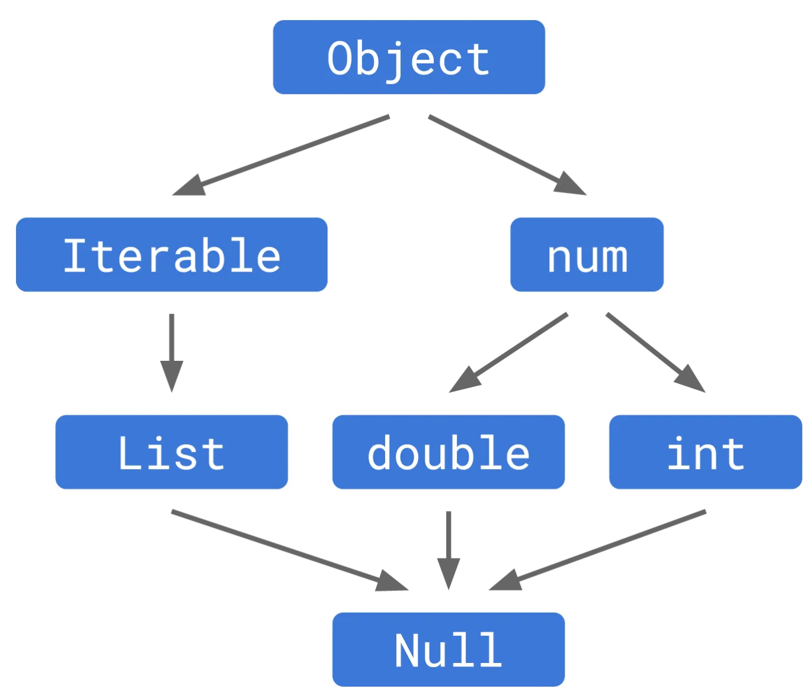
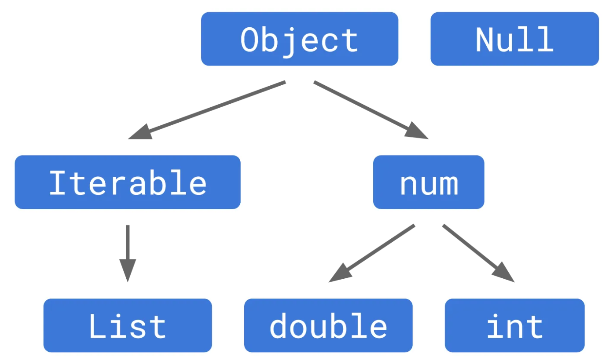

# 소스
- https://dart.dev/language/variables#null-safety
- https://dart.dev/null-safety/understanding-null-safety#using-nullable-types


# Null Safety

널 안전성(null safety)이란 널 포인트 예외를 프로그램을 실행하기 전 코드를 작성하는 시점에 점검하는 것을 의미한다.
객체가 특정 값이 아닌 null을 가리켜서 발생하는 오류이며 컴파일러가 걸러내지 못하고 프로그램 실행 중에 발생하므로 치명적일 수 있습니다.
또한 디버깅이 어려운점이 있습니다.

다트는 널 안전성을 지원하는 언어이며, 객체가 널일 때 발생할 수 있는 오류를 코드 작성 시점에 점검해 준다.
플러터 2.0 이 나오면서 다트가 2.12.0 버전으로 업데이트 되었고 이 버전부터 널 안전성을 지원하기 시작했다.
참고로 현재 다트 최신 stable 버전은 3.4.4 이다.

Dart analyzer(코드 분석 도구) 와 compiler는 다음을 찾아냅니다.
- 널값으로 초기화 된 경우
- 널값을 할당 받은 경우

 
# 연산자 ?
기본적으로 모든 타입의 변수에는 null를 할당할 수 없다. (Dart considers all variables non-nullable)
null을 할당하기 위해서는 타입 어노테이션 뒤에 ?를 붙여야한다.

```dart
int a1;  // 오류
int? a2;  // null로 초기화
```

# 널 안전성 미지원 패키지
널 안전성 미지원 패키지들은 기본적으로 사용할 수 없다. (강제는 가능)
이전 버전의 패키지들은 마이그레이션 필요.


# deep understanding

다트가 null safety를 만드는데 기준이 된 원칙들.

1. 코드는 기본적으로 안전성을 가져야 한다.

개발자가 null safety를 사용하지 않는 한은 모든 null 에러는 런타임에 발생하면 안된다.
작성한 코드의 null safety가 보장됩니다.

2. 널 안전성 코드는 작성하기 쉬워야한다.

3. 정적 타입 검사가 정확하고, 널을 허용하지 않는 타입의 표현식은 실제로 실행 시점에도 절대로 널이 될 수 없다. 완전한 안정성 보장하므로 컴파일러는 null 검사를 할 필요가 없으므로 최적화 가능 


널 안전성 도입 이전에는 null은 모든 타입들의 서브 타입이었습니다.
하지만 도입 후에는 완전히 다른 계층의 타입으로 변경되었습니다.



String? 은 String|Null 의 약어로 볼수 있음. 즉 String? 은 String과 Null 타입 모두 가능한 union 타입을 할당하는 것


# ?. 연산자
```dart
// Hypothetical unsound null safety:
void bad(String? maybeString) {
  print(maybeString.length);  # error
}

void main() {
  bad(null);
}
```
🔽 수정

```dart
void bad(String? maybeString) {
  print(maybeString?.length);
}

void main() {
  bad(null);
}
```
- ?. 연산자의 동작


.? 연산자는 객체가 null인지 아닌지 확인한 다음, null이 아닌 경우에만 해당 속성이나 메서드에 접근합니다. 객체가 null인 경우, 해당 표현식 전체가 null을 반환합니다.


# implicit downcasts 제거
```
// Hypothetical unsound null safety:
void requireStringNotNull(String definitelyString) {
  print(definitelyString.length);
}

void main() {
  String? maybeString = null; // Or not!
  requireStringNotNull(maybeString);
}
```
non-nullable types are modeled as subtypes of nullable types
그러나 null safety에서는 implicit downcasts를 제거하였다.